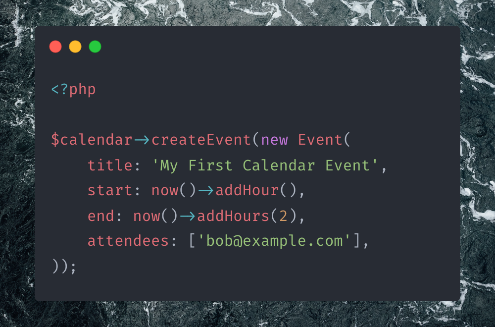

# Calendar

Easily manage Google & Microsoft calendars.

# Setup

Before managing events, you need to initialise a Google or Microsoft calendar.

### Initializing Google Calendar

To initialise a Google calendar, you need to pass client & user credentials
and a callback that is run when an expired access token is refreshed.

```php
$calendar = Calendar::google(
    client: [
        'client_id' => 'GOOGLE_CLIENT_ID,'
        'client_secret' => 'GOOGLE_CLIENT_SECRET',
    ],
    token: [
        'refresh_token' => 'USER_REFRESH_TOKEN',
        'access_token' => 'USER_ACCESS_TOKEN',
        'created' => 1679422799,
        'expires_in' => 1679426399,
    ],
    onTokenRefresh: fn (array $token) => var_dump($token),
);
```

### Initializing Microsoft Calendar

To initialise a Microsoft calendar, you may pass user credentials
and a callback that is run when an expired access token is refreshed.

```php
$calendar = Calendar::microsoft(
    token: [
        'refresh_token' => 'USER_REFRESH_TOKEN',
        'access_token' => 'USER_ACCESS_TOKEN',
        'created' => 1679422799,
        'expires_in' => 1679426399,
    ],
    onTokenRefresh: fn (array $token) => var_dump($token),
);
```

# Usage

## Creating Events

To create a calendar event, simply pass a new `Event` instance to the `createEvent` method.

```php
$event = $calendar->createEvent(new Event(
    title: 'My fist event',
    start: Carbon::now()->addMinutes(30),
    end: Carbon::now()->addMinutes(60),
    attendees: ['john.doe@example.com'],
));
```

## Retrieving Events

To retrieve an event, simply pass an `id` of the event to the `getEvent` method.

```php
$event = $calendar->getEvent('442d81dvg884c57an0g778e184'));
```

## Updating Events

To update an event, simply pass an `Event` instance to the `updateEvent` method.

```php
$event->title = 'Updated Event Title';
$calendar->updateEvent($event));
```

## Deleting Events

To delete an event, simply pass an event id to the `deleteEvent` method.

```php
$calendar->deleteEvent('442d81dvg884c57an0g778e184'));
```

## Listing Events

To list events, simply call the `getEvents` method. The result of this method is an instance of a `Paginator` object.

```php
$paginator = $calendar->getEvents();
```

To loop through all event pages, you may call the `next` method on the `Paginator` instance.

```php
while ($events = $paginator->next()) {
    //
}
```

To loop through all events from all pages, you may call the `each` method on the `Paginator` instance and pass
a callback that is run with each event instance.

```php
$calendar->each(function (Event $event) {
    //
});
```

To collect all events in memory, you may call the `all` method on the `Paginator` instance.

```php
$events = $paginator->all();
```

## Listing Calendars

To list calendars, simply call the `getCalendars` method. The result of this method is an instance of a `Paginator` object.

```php
$paginator = $calendar->getCalendars();
```

To loop through all calendar pages, you may call the `next` method on the `Paginator` instance.

```php
while ($calendars = $paginator->next()) {
    //
}
```

To loop through all calendars from all pages, you may call the `each` method on the `Paginator` instance and pass
a callback that is run with each calendar instance.

```php
$paginator->each(function (Calendar $calendar) {
    //
});
```

To collect all calendars in memory, you may call the `all` method on the `Paginator` instance.

```php
$calendars = $paginator->all();
```

# Resources

Below, you may find FULL definitions of each calendar resource.

```php
new Event(
    title: 'My First Calendar Event',
    start: now()->addMinutes(30),
    end: now()->addMinutes(60),
    organiser: new Organiser('john@example.com'),
    attendees: [
        new Attendee(email: 'bob@example.com', rsvp: Rsvp::ACCEPTED),
        new Attendee(email: 'rob@example.com', rsvp: Rsvp::PENDING),
    ],
    calendar: 'primary',
    id: '442d81dvg884c57an0g778e184',
);

new Calendar(
    provider: 'google',
    id: '442d81dvg884c57an0g778e184',
    name: 'Public Holidays Calendar',
);
```

# Extending

To add a new provider, simple implement the `Provider` interface with your provider.

```php
interface Provider
{
    /**
     * List calendars.
     *
     * @return \TitasGailius\Calendar\Contracts\Paginator<\TitasGailius\Calendar\Resources\Calendar>
     */
    public function getCalendars(): Paginator;

    /**
     * List events.
     *
     * @return \TitasGailius\Calendar\Contracts\Paginator<\TitasGailius\Calendar\Resources\Event>
     */
    public function getEvents(): Paginator;

    /**
     * Create an event.
     */
    public function createEvent(Event $event): Event;

    /**
     * Get event.
     */
    public function getEvent(string|Event $id): ?Event;

    /**
     * Save a new event.
     */
    public function updateEvent(Event $event): Event;

    /**
     * Delete a given event.
     */
    public function deleteEvent(string|Event $event): void;
}
```

then, register your custom `Calendar` provider

```php
Calendar::extend('calendly', function (array $config = []) {
    return new CalendlyProvider($options);
});
```

Finally, you may retrieve your custom provider by calling the `provider` method

```php
$calenar = Calendar::provider('calendly', [
    'token ' => 'CALENDLY_TOKEN',
]);
```
